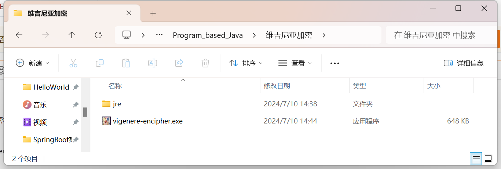

# vigenere-encipher

#### 介绍
基于维吉尼亚加密算法的加解密程序

#### 软件架构
本项目由Java17编写，使用Maven进行打包操作

#### 使用说明

1.本项目采用jre-17版本JVM运行 
2.安装jre-17后，在cmd中进入jar包目录输入java -jar vigenere-encipher-1.0-SNAPSHOT.jar即可开始游戏

#### 安装说明

1.将jre-17版本JVM置于想要进一步打包的格式的（.exe）同一目录下 
2.有了jar包后可以使用将jar包变为.exe运行文件的软件（例如exe4j Wizard）进行进一步打包，如图所示： 
